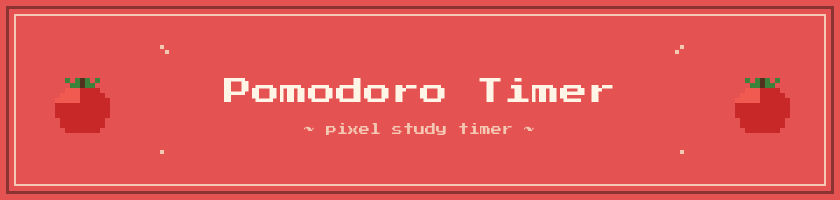

<p align="center">
  
</p>

<p align="center">
  🍅 Un temporizador Pomodoro interactivo con estética pixel art 🎮
</p>

<p align="center">
  <a href="https://allison-bd.github.io/proyectos-propios/pomodoro/">🌐 Ver demo en vivo</a>
</p>

---

## 🍅 ¿Qué es el Método Pomodoro?

La técnica Pomodoro fue creada en los años 80 por Francesco Cirillo, un estudiante universitario que buscaba una forma de mejorar su concentración. Inspirado por un temporizador de cocina con forma de tomate (*pomodoro* en italiano), desarrolló un método simple pero efectivo: dividir el trabajo en bloques de **25 minutos de enfoque** seguidos de **5 minutos de descanso**. Después de completar 4 ciclos, se toma un descanso más largo.

¿Por qué funciona? Al trabajar en intervalos cortos y definidos, el cerebro mantiene un nivel alto de atención sin llegar al agotamiento. Los descansos frecuentes permiten procesar mejor la información, lo que mejora la retención de lo aprendido. Además, la estructura del método reduce la procrastinación: es mucho más fácil comprometerse con "solo 25 minutos" que con una sesión de estudio indefinida.

## 🎮 Sobre este proyecto

Este Pomodoro Timer nació como proyecto personal durante mi formación como desarrolladora Full Stack. Quise construir una herramienta que realmente utilizara para estudiar, pero también quise darle una identidad visual que reflejara algo que me gusta mucho: la **estética pixel art**.

Cada detalle fue pensado para crear una experiencia coherente y agradable:

- **Paleta de colores** cuidadosamente seleccionada, con tonos cálidos que combinan entre sí y mantienen la armonía visual.
- **Tipografía pixel art** (PixeloidMono) que refuerza la estética retro en todo el diseño.
- **Efectos de sonido suaves**, elegidos para que no resulten invasivos: sonidos distintos para los controles, los ajustes y las transiciones, todos manteniendo un volumen agradable.
- **Botones con efecto "presionado"** que simulan la respuesta táctil de los controles retro.
- **Círculos de progreso en pixel art** que muestran visualmente los ciclos completados.

## ✨ Funcionalidades

### ⏱️ Temporizador configurable

Si bien el método Pomodoro clásico establece 25 minutos de enfoque y 5 de descanso con 4 repeticiones, cada persona tiene necesidades diferentes. Por eso, este timer permite ajustar los tiempos con botones `+` y `-`, pero con restricciones pensadas para mantener un uso saludable:

| Parámetro     | Mínimo  | Máximo   | Por defecto |
|---------------|---------|----------|-------------|
| Enfoque       | 5 min   | 60 min   | 25 min      |
| Descanso      | 1 min   | 30 min   | 5 min       |
| Repeticiones  | 1       | 5        | 4           |

Los valores se pueden modificar incluso mientras el temporizador está en marcha.

### 🖼️ Modo Mini (Picture-in-Picture)

El botón **"Modo mini"** permite abrir una ventana flotante que se mantiene siempre visible sobre otras aplicaciones. De esta forma, puedes seguir viendo el tiempo restante mientras trabajas en otras ventanas. Al cerrar la ventana mini, los controles regresan a su posición original.

> ⚠️ Esta funcionalidad utiliza la API Document Picture-in-Picture, disponible actualmente en navegadores basados en Chromium (Chrome, Edge, Brave). El botón se oculta automáticamente en navegadores que no la soportan.

### 🔔 Notificaciones y señales

- El **título de la pestaña** se actualiza en tiempo real con el conteo regresivo, para que puedas ver el tiempo restante sin cambiar de pestaña.
- Al completar todos los ciclos, el temporizador muestra un mensaje de **"¡Sesión completa!"** con un sonido distintivo.
- Sonidos diferentes para cada tipo de interacción: controles principales, botones de ajuste y transiciones entre fases.

## 🛠️ Tecnologías utilizadas

- **HTML5**
- **CSS3** — diseño responsive, variables CSS, box-shadow para el efecto pixel art
- **JavaScript (Vanilla)** — sin frameworks ni librerías externas
- **Document Picture-in-Picture API** — para el modo mini flotante
- **Google Fonts** — fuente PixeloidMono

## 📁 Estructura del proyecto

```
pomodoro/
├── index.html
└── assets/
    ├── css/
    │   └── styles.css
    ├── js/
    │   └── app.js
    ├── fonts/
    │   ├── PixeloidMono.woff
    │   └── PixeloidMono.woff2
    ├── img/
    │   └── tomato.png
    └── sonidos/
        ├── click-control.wav
        ├── click-mas.wav
        ├── click-menos.wav
        ├── inicio-descanso.wav
        └── finalizado.wav
```

## 👩‍💻 Autora

Desarrollado por **Allison Barra Díaz** como proyecto personal durante su formación como desarrolladora Full Stack JavaScript.

[](https://github.com/allison-bd)
